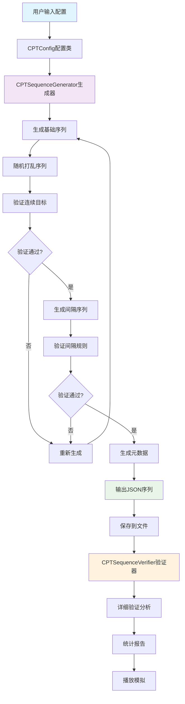

# CPT数字序列生成器

这是一个专为持续表现任务(Continuous Performance Task, CPT)设计的数字序列生成器，能够生成符合心理学实验标准的刺激序列。

## 功能特点

- ✅ 生成1-9数字范围内的标准化序列
- ✅ 可配置目标数字和出现比例
- ✅ 自动验证连续目标数量限制
- ✅ 生成可变刺激间隔(500-1000ms)
- ✅ 验证序列总时长(约60秒)
- ✅ 完整的序列验证和统计分析
- ✅ JSON格式保存和加载
- ✅ 播放模拟功能

## 文件结构

```
ar_ui/
├── seq.py              # 核心序列生成器
├── verify_sequence.py  # 序列验证工具
├── example_usage.py    # 使用示例
└── README_CPT.md      # 本文档
```

## 快速开始

### 1. 基础使用

```python
from seq import CPTSequenceGenerator

# 创建生成器（使用默认配置）
generator = CPTSequenceGenerator()

# 生成序列
sequence = generator.generate_sequence()

# 保存序列
generator.save_sequence(sequence, 'my_sequence.json')
```

### 2. 自定义配置

```python
from seq import CPTSequenceGenerator, CPTConfig

# 创建自定义配置
config = CPTConfig(
    target_digit=7,          # 目标数字
    target_ratio=0.25,       # 目标比例25%
    sequence_length=50,      # 序列长度
    isi_range=(600, 1200),   # 间隔范围600-1200ms
    max_consecutive_targets=2 # 最大连续目标数
)

generator = CPTSequenceGenerator(config)
sequence = generator.generate_sequence()
```

### 3. 验证序列

```bash
# 基础验证
python verify_sequence.py my_sequence.json

# 带播放模拟
python verify_sequence.py my_sequence.json --simulate --speed 10
```

## 配置参数

| 参数 | 默认值 | 说明 |
|------|--------|------|
| `digits_range` | `(1, 9)` | 数字范围 |
| `target_digit` | `5` | 目标数字 |
| `sequence_length` | `40` | 序列长度 |
| `target_ratio` | `0.3` | 目标比例(30%) |
| `stimulus_duration` | `800` | 刺激持续时间(ms) |
| `isi_range` | `(500, 1000)` | 刺激间隔范围(ms) |
| `max_consecutive_targets` | `3` | 最大连续目标数 |
| `max_consecutive_intervals` | `3` | 最大连续相同间隔数 |

## 输出格式

生成的序列文件为JSON格式，包含以下结构：

```json
{
  "digits": [1, 5, 3, 7, ...],           // 显示的数字
  "is_target": [false, true, false, ...], // 是否为目标
  "intervals": [600, 800, 500, ...],      // 刺激间隔(ms)
  "metadata": {                           // 元数据
    "config": {...},                      // 配置信息
    "statistics": {...}                   // 统计信息
  }
}
```

## 验证标准

生成的序列会自动验证以下标准：

1. **长度一致性**: 数字、目标标识、间隔列表长度相同
2. **目标比例**: 实际比例与期望比例偏差≤5%
3. **连续目标**: 连续目标数量≤3个
4. **间隔范围**: 所有间隔在指定范围内
5. **连续间隔**: 连续相同间隔≤3个
6. **总时长**: 序列总时长在45-75秒范围内

## 使用示例

### 运行完整示例
```bash
python example_usage.py
```

### 生成特定目标数字的序列
```python
from seq import CPTSequenceGenerator, CPTConfig

for target in [3, 5, 7]:
    config = CPTConfig(target_digit=target)
    generator = CPTSequenceGenerator(config)
    sequence = generator.generate_sequence()
    generator.save_sequence(sequence, f'sequence_target_{target}.json')
```

### 批量验证
```bash
for file in *.json; do
    echo "验证 $file:"
    python verify_sequence.py "$file"
    echo ""
done
```

## 性能特点

- 序列生成速度：< 1ms (标准长度40)
- 自动重试机制：最多100次尝试确保有效序列
- 内存占用：< 1MB (标准配置)
- 支持序列长度：1-1000+ (理论无上限)

## 常见问题

### Q: 生成序列时出现"超过最大重试次数"错误？
A: 这通常是由于配置参数过于严格导致的。可以尝试：
- 增加最大连续目标数量
- 调整目标比例
- 减少序列长度

### Q: 如何确保特定的时间总长？
A: 调整`isi_range`参数。例如60秒总长度：
```python
# 计算: (40 * 800ms + 平均间隔 * 40) / 1000 ≈ 60s
# 平均间隔 ≈ 700ms
config = CPTConfig(isi_range=(600, 800))
```

### Q: 可以使用0作为目标数字吗？
A: 当前版本数字范围为1-9，如需包含0，请修改`digits_range=(0, 9)`。

## 扩展功能

### 自定义验证规则
可以继承`CPTSequenceGenerator`类来添加自定义验证：

```python
class CustomCPTGenerator(CPTSequenceGenerator):
    def _validate_custom_rule(self, sequence):
        # 添加自定义验证逻辑
        return True
```

### 不同刺激类型
虽然当前版本专注于数字，但架构支持扩展到其他刺激类型（字母、形状等）。

## 依赖要求

- Python 3.10+
- 标准库：`json`, `random`, `logging`, `statistics`, `time`, `argparse`

## 许可证

本项目采用开源许可证，可自由使用和修改。




